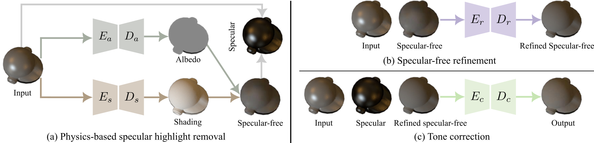

# TSHRNet

In this work, we propose a three-stage specular highlight removal network. To support network training and quantitative evaluation, we also present a large-scale synthetic dataset.

### [Paper](https://arxiv.org/pdf/2309.06302.pdf)

**Towards High-Quality Specular Highlight Removal by Leveraging Large-scale Synthetic Data**
<br>_Gang Fu, Qing Zhang, Lei Zhu, Chunxia Xiao, and Ping Li_<br>
In ICCV 23

## Overview of our methodology

The following figure presents the pipeline of our three-stage framework. It consists of three stages: (i) physics-based specular highlight removal; (ii) specular-free refinement; and (iii) tone correction. Specifically, in the first stage (see (a)), we decompose an input image into its albedo and shading using two encoder-decoder networks ($E_a-D_a$ for albedo, and $E_s-D_s$ for shading). Then, the specular-free image can be estimated by multiplying the albedo and shading. In the second stage (see (b)), we feed the coarse result along with the input into an encoder-decoder network ($E_r-D_r$) to further refine it to alleviate visual artifacts. In the third stage (see (c)), we feed the refined result along with the input and its specular residue image into an encoder-decoder network ($E_c-D_c$) to adjust its tone so that it has the similar tone as the input as much as possible.

<p align=center></p>


## Prerequisities of our implementation

```
conda create --yes --name TSHRNet python=3.9
conda activate TSHRNet
conda install --yes pytorch==1.13.0 torchvision==0.14.0 torchaudio==0.13.0 pytorch-cuda=11.6 -c pytorch -c nvidia
conda install --yes tqdm matplotlib
```

Please see "dependencies_install.sh".

## Datasets

* Our SSHR dataset is available at [Google Drive](https://drive.google.com/file/d/1YitISbuObKi4KFizuBU_V_KSrLE710qK/view?usp=sharing) or [OneDrive](https://polyuit-my.sharepoint.com/:u:/g/personal/gangfu_polyu_edu_hk/EUUzYa-c2ZhDrjeovZWWgSABDY5c2eql0IwS4XTFt7hqrQ?e=C7C2Yf) (~5G).
* The SHIQ dataset can be found in the project [SHIQ](https://github.com/fu123456/SHIQ).
* The PSD dataset can be found in the project [SpecularityNet-PSD](https://github.com/jianweiguo/SpecularityNet-PSD).

## Training

The bash shell script file of "train.sh" provides the command lines for traning on different datasets.

### Training on SSHR

```
python train_4_networks.py \
       -trdd dataset \
       -trdlf dataset/SSHR/train_7_tuples.lst \
       -dn SSHR
```

### Training on SHIQ

```
python train_4_networks_mix.py \
       -trdd dataset \
       -trdlf dataset/SHIQ_data_10825/train.lst \
       -dn SHIQ
```

### Training on PSD

```
python train_4_networks_mix.py \
       -trdd dataset \
       -trdlf dataset/M-PSD_Dataset/train.lst \
       -dn PSD_debug_1
```

### Training on the mixed data

```
cat dataset/SSHR/train_4_tuples.lst dataset/SHIQ_data_10825/train.lst dataset/M-PSD_Dataset/train.lst >> dataset/train_mix.lst
python train_4_networks_mix.py \
       -trdd dataset \
       -trdlf dataset/train_mix.lst \
       -dn mix_SSHR_SHIQ_PSD
```

## Testing

The bash shell script file of "test.sh" provides the command lines for testing on different datasets.

### Testing on SSHR

Note thatwe split "test.lst" into four parts for testin, due to out of memory.

```
num_checkpoint=60 # the indexes of the used checkpoints
model_name='SSHR' # find the checkpoints in "checkpoints_${model_name}, like "checkpoints_SSHR"
testing_data_name='SSHR' # testing dataset name
# processing testing images
python test_4_networks.py -mn ${model_name} -l ${num_checkpoint} -tdn ${testing_data_name} -tedd 'dataset' -tedlf 'dataset/SSHR/test_7_tuples_part1.lst'
python test_4_networks.py -mn ${model_name} -l ${num_checkpoint} -tdn ${testing_data_name} -tedd 'dataset' -tedlf 'dataset/SSHR/test_7_tuples_part2.lst'
python test_4_networks.py -mn ${model_name} -l ${num_checkpoint} -tdn ${testing_data_name} -tedd 'dataset' -tedlf 'dataset/SSHR/test_7_tuples_part3.lst'
python test_4_networks.py -mn ${model_name} -l ${num_checkpoint} -tdn ${testing_data_name} -tedd 'dataset' -tedlf 'dataset/SSHR/test_7_tuples_part4.lst'
```

### Testing on SHIQ

```
num_checkpoint=60
model_name='SHIQ'
testing_data_name='SHIQ'
python test_4_networks_mix.py -mn ${model_name} -l ${num_checkpoint} -tdn ${testing_data_name} -tedd 'dataset' -tedlf 'dataset/SHIQ_data_10825/test.lst'
```

### Testing on PSD

```
num_checkpoint=60
model_name='PSD'
testing_data_name='PSD'
python test_4_networks_mix.py -mn ${model_name} -l ${num_checkpoint} -tdn ${testing_data_name} -tedd 'dataset' -tedlf 'dataset/M-PSD_Dataset/test.lst'
```

## Index structure of image groups

Please, put the SSHR, SHIQ, and PSD datasets into the directory of "dataset".

For seven-tuples image groups (i.e. including additional albedo and shading), their index structure has the following forms:

```
SSHR/train/048721/0024_i.jpg SSHR/train/048721/0024_a.jpg SSHR/train/048721/0024_s.jpg SSHR/train/048721/0024_r.jpg SSHR/train/048721/0024_d.jpg SSHR/train/048721/0024_d_tc.jpg SSHR/train/048721/0024_m.jpg
SSHR/train/048721/0078_i.jpg SSHR/train/048721/0078_a.jpg SSHR/train/048721/0078_s.jpg SSHR/train/048721/0078_r.jpg SSHR/train/048721/0078_d.jpg SSHR/train/048721/0078_d_tc.jpg SSHR/train/048721/0024_m.jpg
... ...

```
From left to right, they are input, albedo, shading, specular residue, diffuse, tone-corrected diffuse, and object mask images, respectively.

For four-tuples image groups, their index structure has the following forms (taking our SSHR as an example).

```
SSHR/train/048721/0044_i.jpg SSHR/train/048721/0044_r.jpg SSHR/train/048721/0044_d.jpg SSHR/train/048721/0044_d_tc.jpg
SSHR/train/048721/0023_i.jpg SSHR/train/048721/0023_r.jpg SSHR/train/048721/0023_d.jpg SSHR/train/048721/0023_d_tc.jpg
... ...
```

From left to right, they are input, specular residue, diffuse, and tone-corrected diffuse images, respectively. The main reason for is that it allows to be trained with four-tuples image grops of the SHIQ and PSD datasets. Please download our SSHR dataset and see it for more details.


For SHIQ, four-tuples image groups are like:

```
SHIQ_data_10825/train/00583_A.png SHIQ_data_10825/train/00583_S.png SHIQ_data_10825/train/00583_D.png SHIQ_data_10825/train/00583_D_tc.png
SHIQ_data_10825/train/08766_A.png SHIQ_data_10825/train/08766_S.png SHIQ_data_10825/train/08766_D.png SHIQ_data_10825/train/08766_D_tc.png
... ...
```

For PSD, their images can be constructed as the above form in a list file.

## Pretrained models

* Pretrained models on SSHR are available at [checkpoints_SSHR](https://drive.google.com/file/d/1Nl4y--ZP6iqyIAbd7erQpR76lAfa8OG_/view?usp=sharing).
* Pretrained models on the mix data are available at [checkpoints_mix_SSHR_SHIQ_PSD](https://drive.google.com/file/d/1B_0z6Mh4q43hRFaw24_MbkIN8HACKA4_/view?usp=sharing).


## Citation

```
@inproceedings{fu-2023-towar-a,
  author =	 {Fu, Gang and Zhang, Qing and Zhu, Lei and Xiao, Chunxia and Li, Ping},
  title =	 {Towards high-quality specular highlight removal by leveraging large-scale synthetic data},
  booktitle =	 {Proceedings of the IEEE International Conference on Computer Vision},
  year =	 {2023},
  pages =	 {To appear},
}
```

## Contact

If you have any questions about this project, please contact me by xyzgfu@gmail.com
