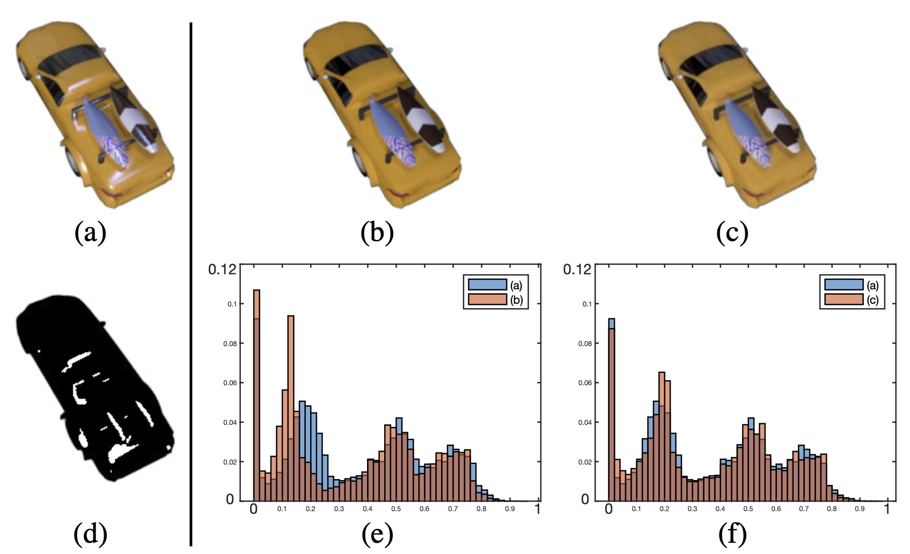

# Tone Correction (TC)

TC is to correct the tone of the ground truth specular-free images in our dataset as new supervisionss for network training. The following figure illustrates this mechanism.

**Figure** Tone correction for ground truth specular-free images in our dataset. (a) Input. (b) Ground truth specular-free image. (c) Tone correction version of (b). (d) Specular highlight mask of (a). (e) Histogram comparison between (a) and (c). Note that the specular highlight pixels are excluded using (d) for plotting histograms of (a)-(c).

## How to use

"tone_correction.m" is the main file for tone correction. You may need to modify some variable for correctly running on Matlab software. Please, modify the variable "data_dir" as the directory of the SSHR dataset. If you use this code for other datasets, also modify the variables of "dataFiles", "specular_residue_name", "diffuse_name", and "diffuse_tc_name". Please see the main file for more details.
